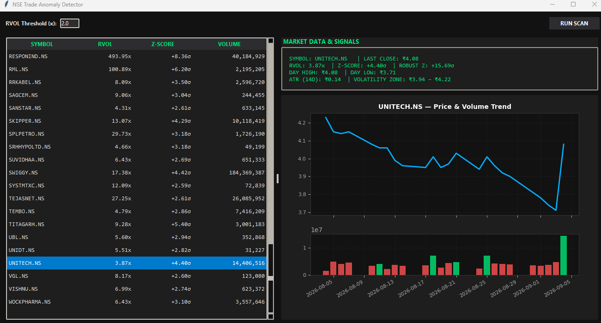
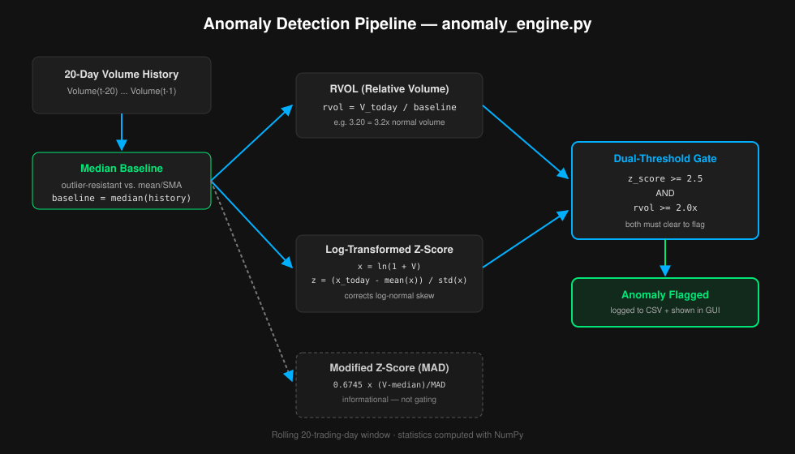

# NSE Trade Anomaly Detector 🚀

A high-throughput, multithreaded quantitative volume-anomaly scanner for the **Indian Stock Market (NSE)**. It dynamically scans **2,500+ publicly listed NSE equities** in parallel, using log-transformed relative volume (RVOL) and Z-scores to flag statistically unusual volume activity indicating potential institutional accumulation.



---

## Key Features

* **📐 Statistical Volume-Anomaly Engine**: Log-transformed RVOL and Z-scores correct for the log-normal, right-skewed distribution of trading volume — see [Methodology](#methodology).
* **⚡ ~98% Scan-Time Reduction**: Parallelized data collection with Python's `ThreadPoolExecutor` scans the full NSE universe (2,500+ tickers) in seconds instead of minutes.
* **🛡️ Outlier-Resistant Baseline**: Median and Median Absolute Deviation (MAD) replace a naive moving average, so a single historical spike doesn't distort the baseline.
* **🎯 Dual-Threshold Flagging**: An anomaly is only flagged when BOTH Z-score (≥ 2.5σ) and RVOL (≥ 2.0x) clear their thresholds, reducing false positives from single-metric heuristics.
* **📊 Volatility-Adjusted Dashboard**: Dark-themed Tkinter GUI with price/volume charts and a 14-day Average True Range (ATR) zone shown alongside each flagged ticker's RVOL and Z-score. This is a descriptive volatility measure, not a buy/sell signal or price prediction.
* **🇮🇳 Complete NSE Coverage**: Dynamically fetches the official master list of all active equities from NSE India archives — zero hardcoded stock symbols.

---

## Methodology



Trading volume is **log-normally distributed and right-skewed** — a naive percentage-change or mean-based baseline is easily distorted by prior spikes and produces unreliable signals. This engine uses statistically robust, outlier-resistant methods instead.

| Metric | Formula | Purpose |
|---|---|---|
| **Baseline** | `median(Volume_{t-20} ... Volume_{t-1})` | Outlier-resistant baseline, unaffected by a single historical spike |
| **RVOL** | `Volume_today / Baseline` | Relative volume surge vs. typical activity |
| **Log Z-Score** | `(ln(1+V_today) - μ_log) / σ_log` over `ln(1+V)` history | Corrects for volume's log-normal distribution |
| **Modified Z-Score (MAD)** | `0.6745 × (V_today - median) / MAD` | Secondary outlier-resistant robustness check (informational, not gating) |

**Flagging rule:** a security is flagged only when **both** `Z-score >= 2.5σ` **and** `RVOL >= 2.0x` — computed over a rolling **20-trading-day** window.

**On the dashboard's Volatility Zone:** each flagged ticker's chart shows a 14-day Average True Range (ATR) band around the last close (`last_close ± ATR`). ATR is a standard technical measure of a stock's typical daily trading range (Wilder, 1978) — it describes how much a stock normally moves, it does not predict direction or forecast a return. It is shown for context alongside the RVOL/Z-score that actually drove the flag, not as a trading recommendation.

---

## Setup & Installation

```bash
git clone https://github.com/<your-username>/<your-repo>.git
cd <your-repo>
pip install -r requirements.txt
```

### Required Packages
* `pandas`
* `numpy`
* `yfinance`
* `matplotlib`
* `requests`

---

## Running the Application

### 1. Dashboard (Recommended)
```bash
python gui.py
```
Enter an RVOL threshold (default `2.0`) and click **RUN SCAN**. Select any flagged ticker from the left table to load its price/volume chart, RVOL/Z-score, and ATR-based volatility zone.

### 2. Command Line
```bash
python main.py                # Default: RVOL >= 2.0x, Z-score >= 2.5σ
python main.py --rvol 2.5     # Require 2.5x relative volume
python main.py --z-score 3.0  # Require 3.0 sigma
```

---

## Project Architecture

```
├── config.py           <- Thresholds & dynamic NSE master list loader
├── anomaly_engine.py    <- Statistical engine (log Z-score, median/MAD, NumPy)
├── alerts.py            <- Console formatting & CSV alert logging
├── main.py              <- CLI entry point with ThreadPoolExecutor parallelization
├── gui.py               <- Dark-themed Tkinter + Matplotlib dashboard (ATR volatility zone)
└── data_sources/
    └── equities.py       <- NSE volume data fetching (Yahoo Finance)
```

---

## Configuration (`config.py`)

* `MIN_Z_SCORE`: Minimum log-normalized Z-score to flag an anomaly (default: `2.5`)
* `MIN_RVOL`: Minimum relative volume multiplier vs. median baseline (default: `2.0`)
* `BASELINE_WINDOW`: Historical sample size for baseline/Z-score calculation (default: `20` trading days)

---

## Disclaimer

Built for **educational and quantitative research purposes only**. Volume anomalies represent statistical deviations from baseline trends and do not constitute financial advice or explicit buy/sell signals. The dashboard's ATR-based volatility zone describes historical trading range only — it is not a price target or prediction.